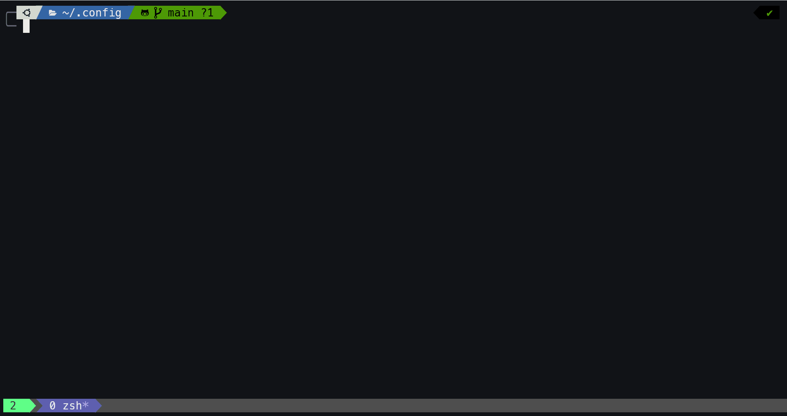

# Dotfiles
Dotfiles for personal use, including nvim, tmux and zsh configurations.

## Preview

## Installation
Run install.sh and it should hopefully work.
There are a few caveats:
- Should be cloned directly into ~/.config. If it already exists, clone this elsewhere and run `cp -r .git ~/.config`, then run install.sh
- ~/.profile, ~/.zprofile, ~/.zshenv, ~/.tmux.conf are overridden
- Rust is only installed on Ubuntu due to usage of snap
- Pretty aggressive in general and meant for fresh machines
